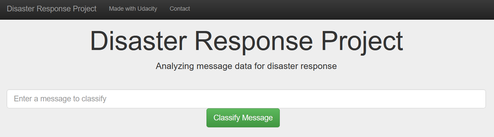
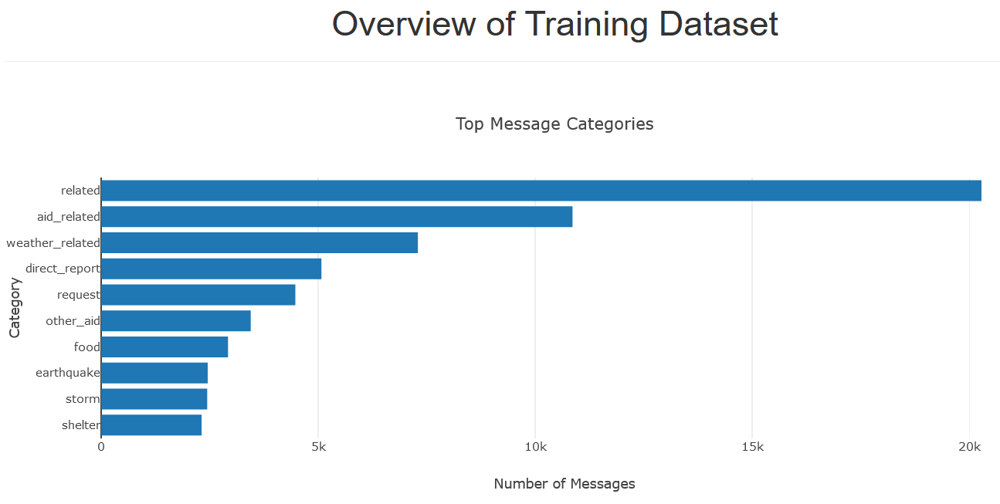
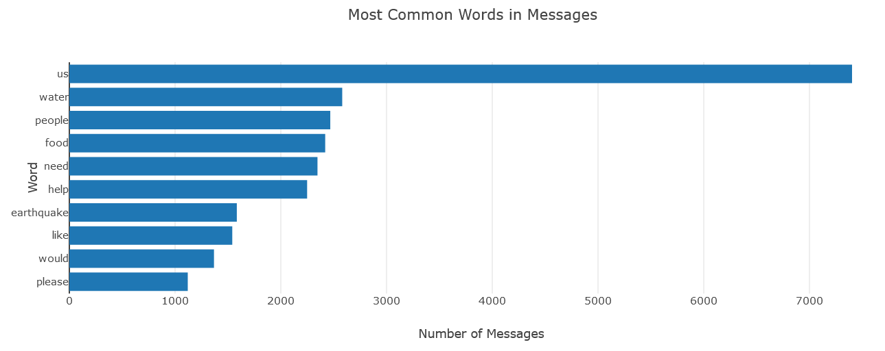
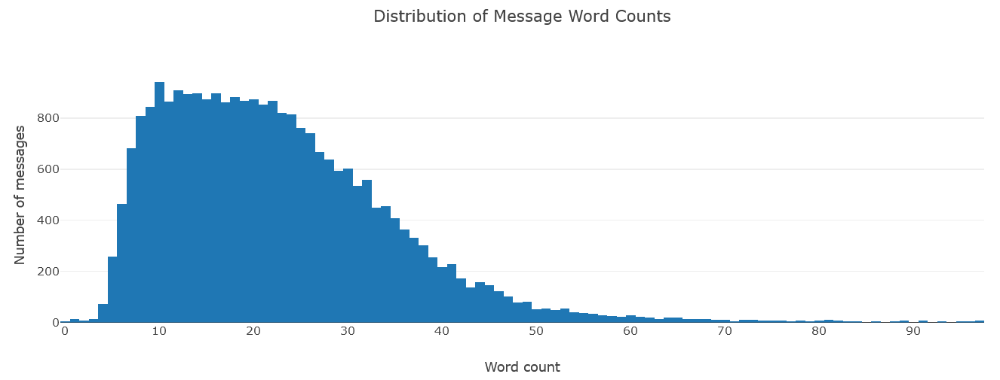
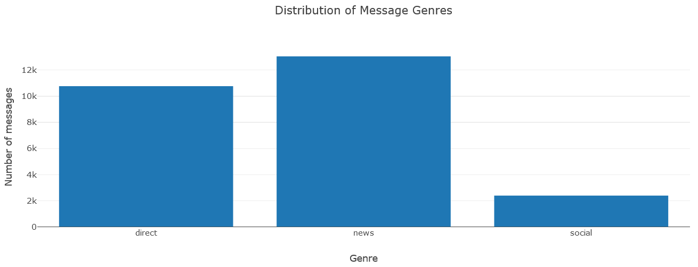
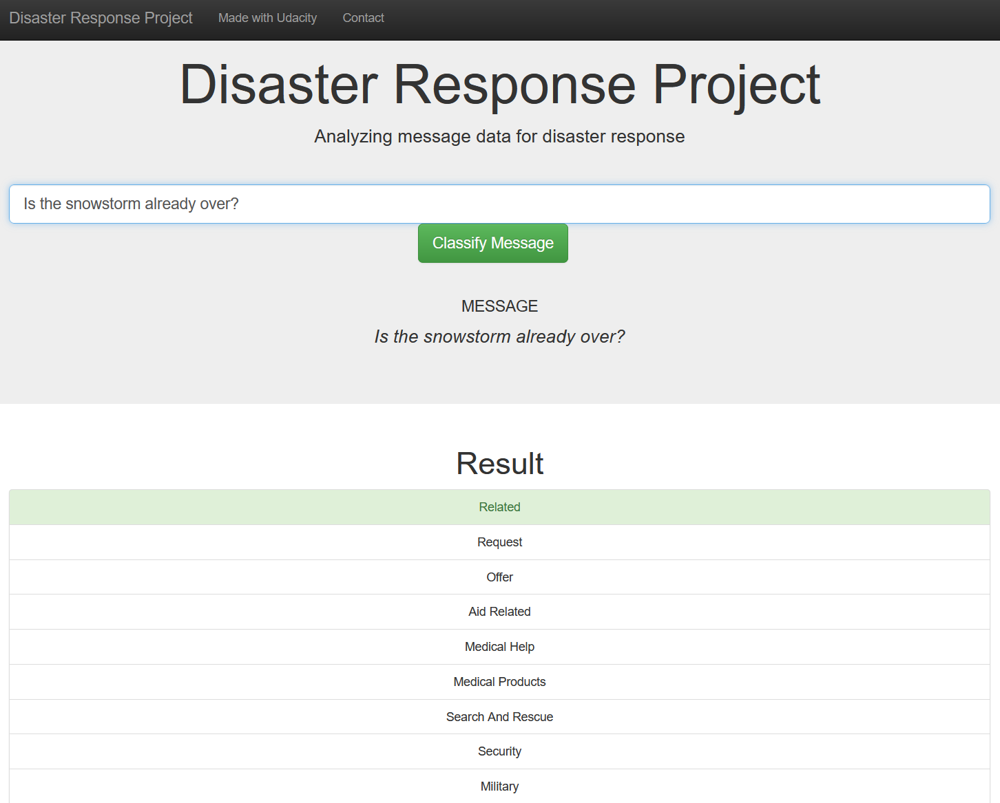

# DSND-Disaster-Response-Pipeline
Udacity Data Science Nanodegree Project - Disaster message classifier web application 


## Introduction

If a disaster occurs in the world, disaster response organizations receive thousands of messages. 
In order to be able to react very promptly to such messages, a targeted classification using machine learning algorithms is required
I have developed a web application so that experts from such organizations can quickly classify and forward such reports. 
The application uses a classifier that was trained on the data described below. 


## Data

The [data](https://appen.com/datasets/combined-disaster-response-data/) in this project comes from [Figure Eight](https://appen.com/) and contains 26,248 labeled messages that were sent during past disasters happend around the world.
This includes news about the earthquake in Haiti (2010) or Storm Sandy (2012) in the USA.

Here is an overview of the 36 categories: <br />

<pre>
'related', 'request', 'offer', 'aid_related', 
'medical_help', 'medical_products',
'search_and_rescue', 'security', 'military', 
'child_alone', 'water', 'food', 'shelter', 
'clothing', 'money', 'missing_people', 'refugees', 
'death', 'other_aid', 'infrastructure_related', 
'transport', 'buildings', 'electricity', 'tools', 
'hospitals', 'shops', 'aid_centers', 
'other_infrastructure', 'weather_related', 
'floods', 'storm', 'fire', 'earthquake', 'cold', 
'other_weather', 'direct_report'
</pre>


Data includes 2 csv files:

1. `messages.csv`: Messages data.
2. `categories.csv`: Disaster categories of messages.


## Folder Structure

```
│   .gitattributes
│   pip_env.txt
│   README.md
│   requirements.txt
│
├───app
│   │   run.py
│   │
│   └───templates
│           go.html
│           master.html
│
├───data
│       categories.csv
│       DisasterResponse.db
│       etl_pipeline.py
│       messages.csv
│       messages.db
│       messages_test.db
│
├───models
│       classifier.pkl
│       dt_model.pkl
│       rf_model.pkl
│       train.py
│
└───notebooks
    │   ETL Pipeline.ipynb
    │   Flask Visualizations.ipynb
    │   ML Pipeline.ipynb
    │
    └───.ipynb_checkpoints
            ETL Pipeline-checkpoint.ipynb
            Flask Visualizations-checkpoint.ipynb
            ML Pipeline-checkpoint.ipynb
```


### Files

`etl_pipeline.py`: ETL script that:

+ Loads the messages and categories datasets
+ Merges the two datasets
+ Cleans the data
+ Stores it in a SQLite database


`train.py`: Machine Learning pipeline that:

+ Loads data from the SQLite database
+ Splits the dataset into training and test sets
+ Builds a text processing and machine learning pipeline
+ Trains and tunes a model using GridSearchCV
+ Outputs results on the test set
+ Exports the final model as a pickle file


`run.py`: Main file to run Flask app that:

+ Classifies real time input text messages
+ Shows data visualizations


`requirements.txt`: List of required Python libraries

`pip_env.txt`: list of pip-installed libraries after pip-installing the `requirements.txt` file

- `notebooks/`
    - `ETL Pipeline.ipynb` - This notebook shows the code exploration for the `etl_pipeline.py` script
    - `ML Pipeline.ipynb` - This notebook shows the code exploration for the `train.py` script
    - `Flask Visualizations.ipynb` - This notebook shows the code exploration for the dashboard visualizations on the home page


## Classifier Results

For the classification of the text files a Random Forest model was trained. 
The classifier was evaluated on a test dataset with the following results:

- Average accuracy: 0.948611 <br />
- Average precision: 0.939444 <br />
- Average recall: 0.948611 <br />
- Average F-score: 0.933889

I also tried Decision Tree models as well as the Random Forest classifier with grid search, but they didn't perform as well as the simple Random Forest model.

Decision Tree metrics:
- Average accuracy: 0.932778 <br />
- Average precision: 0.928611 <br />
- Average recall: 0.932778 <br />
- Average F-score: 0.931389

Decision Tree with grid search metrics:
- Average accuracy: 0.944722 <br />
- Average precision: 0.937222 <br />
- Average recall: 0.944722 <br />
- Average F-score: 0.939167

Random Forest with grid search metrics:
- Average accuracy: 0.945278 <br />
- Average precision: 0.935556 <br />
- Average recall: 0.945278 <br />
- Average F-score: 0.929167


## Getting Started

1. Make sure Python 3 is installed
2. Navigate to the project's root directory in the terminal
3. Run the following command to install the project requirements: `pip install -r requirements.txt`
4. Run the following command to run the ETL pipeline that cleans and store the data: `python data/etl_pipeline.py data/messages.csv data/categories.csv data/messages.db`
5. Run the following command to run the ML pipeline that trains and saves the classifier: `python models/train.py data/messages.db models/classifier.pkl`
6. Navigate to the project's `app/` directory in the terminal
7. Run the following command to run the web app: `python run.py`
8. Navigate to http://127.0.0.1:3001/ in the browser


## Deployment

### Interface Home Page


 

### Visualizations









### Interface Result Page



## Acknowledgements:

1. [Udacity](https://www.udacity.com/) for this Data Science Nanodegree Program.
2. [Figure Eight](https://appen.com/) for the relevant dataset.

